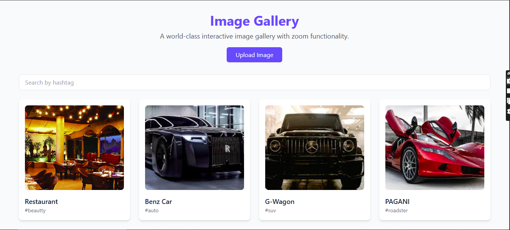
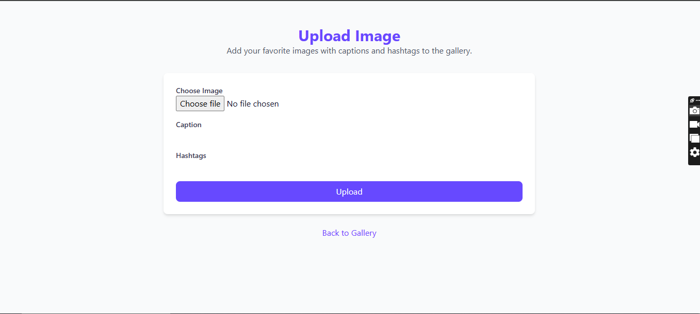
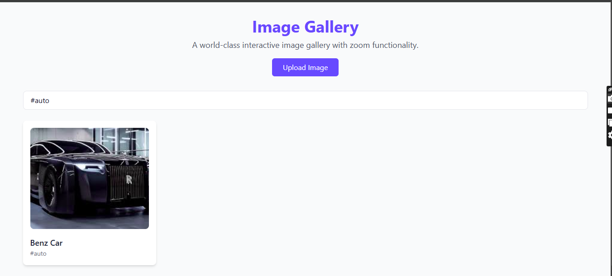

# Ex.08 Design of Interactive Image Gallery
# Date: 16/11/2024
# AIM:
To design a web application for an inteactive image gallery with minimum five images.

# DESIGN STEPS:
## Step 1:
Clone the github repository and create Django admin interface.

## Step 2:
Change settings.py file to allow request from all hosts.

## Step 3:
Use CSS for positioning and styling.

## Step 4:
Write JavaScript program for implementing interactivity.

## Step 5:
Validate the HTML and CSS code.

## Step 6:
Publish the website in the given URL.
https://github.com/Jaiyantan-submissions/Image_Gallery
# PROGRAM :

# views.py:

    from django.shortcuts import render, redirect
    from .models import Image
    from .forms import ImageUploadForm

    def gallery(request):
        images = Image.objects.all()
        return render(request, 'gallery/gallery.html', {'images': images})

    def upload_image(request):
        if request.method == 'POST':
            form = ImageUploadForm(request.POST, request.FILES)
            if form.is_valid():
                form.save()
                return redirect('gallery')
        else:
            form = ImageUploadForm()
        return render(request, 'gallery/upload.html', {'form': form})

# models.py

    from django.db import models

    class Image(models.Model):
        image = models.ImageField(upload_to='images/')
        caption = models.CharField(max_length=255, blank=True)
        hashtags = models.CharField(max_length=255, blank=True)

        def __str__(self):
            return self.caption or "Untitled"
# urls.py

    from django.urls import path
    from . import views

    urlpatterns = [
        path('', views.gallery, name='gallery'),
        path('upload/', views.upload_image, name='upload_image'),
    ]

# gallery.html

    <!DOCTYPE html>
    <html lang="en">
    <head>
        <meta charset="UTF-8">
        <meta name="viewport" content="width=device-width, initial-scale=1.0">
        <link href="https://cdn.jsdelivr.net/npm/tailwindcss@2.2.19/dist/tailwind.min.css" rel="stylesheet">
        
        <link rel="stylesheet" href="https://cdn.jsdelivr.net/npm/@fancyapps/ui/dist/fancybox.css">
        
    </head>
    <body class="bg-gray-50 text-gray-900">
        

            <header class="text-center mb-8">
                <h1 class="text-4xl font-bold text-blue-500">Image Gallery</h1>
                
A world-class interactive image gallery with zoom functionality.

                <a href="" class="mt-4 inline-block bg-blue-500 text-white px-6 py-2 rounded-md hover:bg-blue-600">Upload Image</a>
            </header>

            

                <input
                    type="text"
                    id="hashtagFilter"
                    class="w-full px-4 py-2 border rounded-lg focus:outline-none focus:ring-2 focus:ring-blue-500"
                    placeholder="Search by hashtag"
                    onkeyup="filterGallery()"
                />
            

            

                
                

                    
                    

                        <h3 class="text-lg font-semibold text-gray-800">{{ image.caption }}</h3>
                        
{{ image.hashtags }}

                    

                

                
            

        

        
    </body>
    </html>

# OUTPUT:

# Home Page

# Upload Page

# Search by tags

# RESULT:
The program for designing an interactive image gallery using HTML, CSS and JavaScript is executed successfully.
